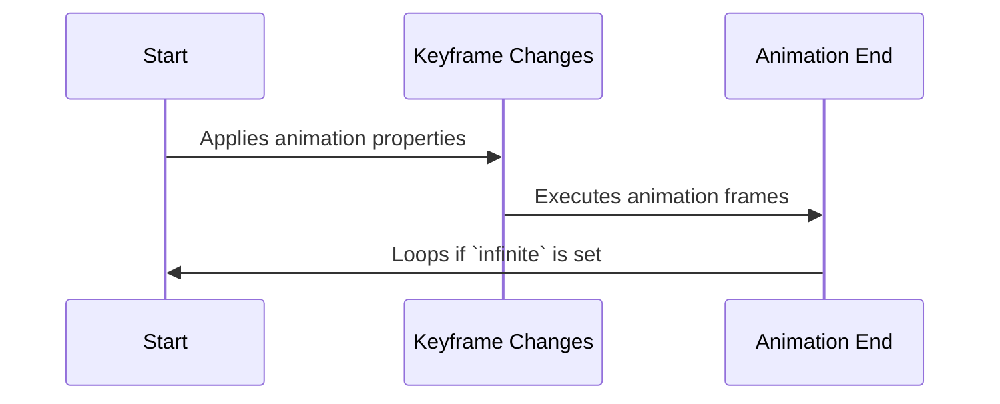

### **CSS Animations**

CSS animations allow elements to transition between different states over a duration.

---

### **1. Defining an Animation (`@keyframes`)**

Use `@keyframes` to define the animation sequence.
```css
@keyframes fadeIn {
    from {
        opacity: 0;
    }
    to {
        opacity: 1;
    }
}
```

Apply it to an element:
```css
.element {
    animation: fadeIn 2s ease-in-out;
}
```

---

### **2. Animation Properties**

| Property          | Description |
|------------------|------------|
| `animation-name` | Specifies the keyframe animation name |
| `animation-duration` | Defines how long the animation runs |
| `animation-timing-function` | Controls speed (e.g., `ease`, `linear`) |
| `animation-delay` | Delays start time |
| `animation-iteration-count` | Number of times animation runs (`infinite` for loop) |
| `animation-direction` | Normal, reverse, alternate, or alternate-reverse |

Example:
```css
.element {
    animation: bounce 1s ease-in-out infinite alternate;
}
```

---

### **3. Keyframes Example**

```css
@keyframes bounce {
    0% {
        transform: translateY(0);
    }
    50% {
        transform: translateY(-20px);
    }
    100% {
        transform: translateY(0);
    }
}
```

---

### **4. Transition vs. Animation**

| Feature      | `transition` | `animation` |
|-------------|-------------|-------------|
| Requires Trigger | Yes | No |
| Keyframes | No | Yes |
| Infinite Loop | No | Yes |

---

### **5. Chaining Multiple Animations**

Apply multiple animations to an element.
```css
.element {
    animation: fadeIn 2s, bounce 1s infinite;
}
```

---

### **6. CSS Animations in Action**



---

### **Conclusion**

CSS animations make websites more dynamic. They allow smooth transitions and effects without JavaScript.

---

### **Next Topic: CSS Responsive Design**
