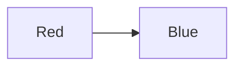

### **CSS Colors and Backgrounds**

CSS provides various ways to apply colors and backgrounds to elements, making web pages visually appealing.

---

### **1. Color Properties**

#### **Text Color (`color`)**
The `color` property changes the text color.
```css
p {
    color: blue;
}
```
```html
<p>This text is blue.</p>
```

#### **Background Color (`background-color`)**
Defines the background color of an element.
```css
div {
    background-color: lightgray;
}
```
```html
<div>This div has a gray background.</div>
```

---

### **2. Color Values**

CSS supports multiple ways to define colors:

- **Named Colors**: `red`, `blue`, `green`
- **Hex Codes**: `#ff0000` (red), `#00ff00` (green)
- **RGB**: `rgb(255, 0, 0)`
- **RGBA**: `rgba(255, 0, 0, 0.5)` (with transparency)
- **HSL**: `hsl(0, 100%, 50%)`

Example:
```css
h1 {
    color: #ff5733;
}
```

---

### **3. Background Properties**

#### **Background Image (`background-image`)**
Sets an image as the background.
```css
body {
    background-image: url('background.jpg');
    background-repeat: no-repeat;
    background-size: cover;
}
```

#### **Background Repeat (`background-repeat`)**
Controls if the background repeats.
```css
div {
    background-repeat: repeat-x; /* Repeats only horizontally */
}
```

#### **Background Position (`background-position`)**
Defines the starting position of the background image.
```css
div {
    background-position: center center;
}
```

#### **Background Size (`background-size`)**
Controls how the image fits in the element.
```css
div {
    background-size: contain; /* Ensures the whole image is visible */
}
```

#### **Background Attachment (`background-attachment`)**
Determines if the background scrolls with content.
```css
body {
    background-attachment: fixed;
}
```

---

### **4. Linear Gradients**
Gradients allow smooth transitions between colors.

Example:
```css
div {
    background: linear-gradient(to right, red, blue);
}
```



---

### **Conclusion**

Mastering CSS colors and backgrounds helps in designing visually engaging webpages. Experiment with different properties to create unique designs.

---

### **Next Topic: CSS Typography**
