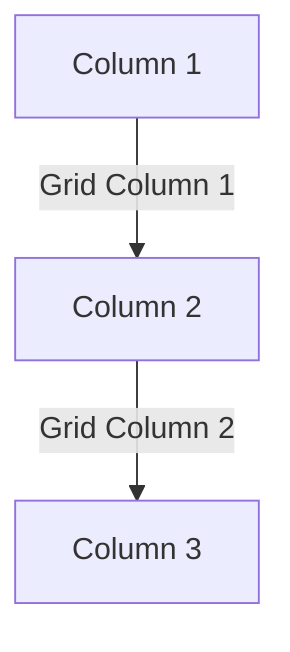

### **CSS Grid**

CSS Grid is a powerful layout system that allows precise control over rows and columns in a grid-based design.

---

### **1. Defining a Grid Container**

Use `display: grid;` to enable the grid layout.
```css
.container {
    display: grid;
}
```

---

### **2. Defining Rows and Columns (`grid-template-rows` & `grid-template-columns`)**

Specify the number and size of rows and columns.
```css
.container {
    grid-template-columns: 200px 200px 200px; /* 3 columns */
    grid-template-rows: 100px 100px; /* 2 rows */
}
```

Using `fr` unit (fractional space):
```css
.container {
    grid-template-columns: 1fr 2fr 1fr;
}
```

---

### **3. Grid Lines and Gaps (`gap`)**

Defines spacing between grid items.
```css
.container {
    gap: 10px;
}
```

---

### **4. Placing Items (`grid-column` & `grid-row`)**

Specify item placement.
```css
.item {
    grid-column: 1 / 3; /* Spans across 2 columns */
    grid-row: 1 / 2;
}
```



---

### **5. Justify and Align Content**

Controls item alignment.
```css
.container {
    justify-content: center; /* start | center | end | space-between | space-around */
    align-content: center; /* Similar properties */
}
```

---

### **6. Grid Auto Placement (`grid-auto-rows` & `grid-auto-columns`)**

Automatically assigns row and column sizes.
```css
.container {
    grid-auto-rows: minmax(100px, auto);
}
```

---

### **7. Grid Areas (`grid-area`)**

Define named grid areas.
```css
.container {
    grid-template-areas:
        "header header"
        "sidebar content";
}

.header { grid-area: header; }
.sidebar { grid-area: sidebar; }
.content { grid-area: content; }
```

---

### **8. Shorthand: `grid`**

Combines multiple properties.
```css
.container {
    grid: auto / auto-flow 200px;
}
```

---

### **Conclusion**

CSS Grid provides precise control over complex layouts with ease.

---

### **Next Topic: CSS Animations**
