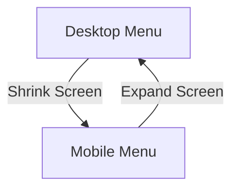

### **CSS Responsive Design**

Responsive design ensures a website adapts to different screen sizes and devices.

---

### **1. Viewport Meta Tag**

Defines how content scales on mobile devices.
```html
<meta name="viewport" content="width=device-width, initial-scale=1.0">
```

---

### **2. Flexible Units**

Use relative units instead of fixed pixels.

| Unit  | Description |
|-------|------------|
| `%`   | Relative to the parent element |
| `em`  | Relative to font size of the parent |
| `rem` | Relative to root element (`html { font-size: 16px; }`) |
| `vw`  | Viewport width |
| `vh`  | Viewport height |

Example:
```css
.container {
    width: 80%;
    font-size: 1.2rem;
}
```

---

### **3. Media Queries**

Adjust styles based on screen size.
```css
@media (max-width: 768px) {
    .container {
        flex-direction: column;
    }
}
```

Breakpoints (common screen sizes):
```css
@media (max-width: 1200px) { /* Large devices */ }
@media (max-width: 992px) { /* Tablets */ }
@media (max-width: 768px) { /* Mobile devices */ }
```

---

### **4. Responsive Images**

Use `max-width: 100%` to prevent images from overflowing.
```css
img {
    max-width: 100%;
    height: auto;
}
```

Use `srcset` to load different images based on screen size.
```html

```

---

### **5. CSS Flexbox and Grid for Responsiveness**

#### **Flexbox Example**
```css
.container {
    display: flex;
    flex-wrap: wrap;
    justify-content: space-between;
}
```

#### **Grid Example**
```css
.container {
    display: grid;
    grid-template-columns: repeat(auto-fit, minmax(200px, 1fr));
}
```

---

### **6. Responsive Navigation Menu**

```css
@media (max-width: 768px) {
    .nav {
        display: none;
    }
}
```



---

### **7. Mobile-First Approach**

Write styles for small screens first, then use media queries for larger screens.

---

### **Conclusion**

Responsive design enhances usability across devices, making websites accessible and user-friendly.

---

### **Next Topic: CSS Preprocessors (SASS & LESS)**
