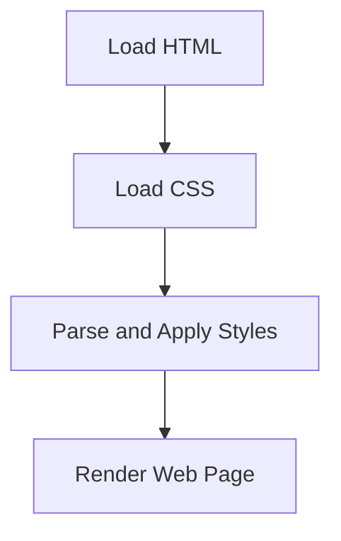

### **Introduction to CSS**

CSS (**Cascading Style Sheets**) is a stylesheet language used to control the presentation and layout of web pages. It allows developers to apply styles such as colors, fonts, spacing, and positioning to HTML elements.

---

### **Why Use CSS?**

- **Separation of Concerns**: Keeps design (CSS) separate from content (HTML), making code cleaner and easier to maintain.
- **Consistency**: Ensures a uniform look across multiple web pages.
- **Responsive Design**: Adapts the layout for different screen sizes and devices.
- **Improved Performance**: Reduces file size and load times by using external stylesheets.

---

### **Types of CSS**

There are three main ways to apply CSS to a webpage:

#### **1. Inline CSS**
Applied directly within an HTML element using the `style` attribute.
```html
<p style="color: blue; font-size: 16px;">This is an example of inline CSS.</p>
```

#### **2. Internal CSS**
Defined within a `<style>` tag inside the HTML document’s `<head>`.
```html
<head>
    <style>
        p {
            color: blue;
            font-size: 16px;
        }
    </style>
</head>
```

#### **3. External CSS**
Stored in a separate `.css` file and linked using `<link>` in the HTML file.
```html
<head>
    <link rel="stylesheet" href="styles.css">
</head>
```
```css
p {
    color: blue;
    font-size: 16px;
}
```

---

### **CSS Syntax**

A CSS rule consists of a **selector** and a **declaration block**.
```css
selector {
    property: value;
    property: value;
}
```

Example:
```css
h1 {
    color: red;
    font-size: 24px;
}
```

---

### **How the Browser Processes CSS**

CSS follows a structured execution process:



---

### **Conclusion**

CSS is essential for creating visually appealing and responsive web pages. Understanding different ways to apply CSS and how the browser processes it is the first step in mastering web design.

---

### **Next Topic: The CSS Box Model**
