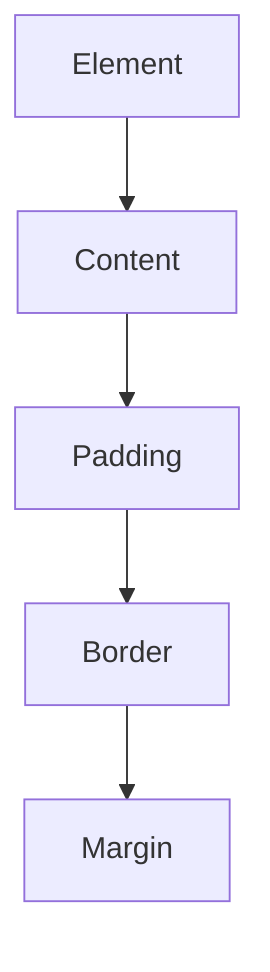

### **The CSS Box Model**

The **CSS Box Model** is a fundamental concept that describes how elements are structured and displayed on a webpage. Every HTML element is treated as a box, consisting of four key areas:

1. **Content** – The actual text or image inside the element.
2. **Padding** – Space between the content and the border.
3. **Border** – A surrounding layer that encloses the padding and content.
4. **Margin** – Space between the element and adjacent elements.

---

### **Understanding the Box Model**

Each element in CSS follows this structure:



---

### **Visual Representation**

Here’s a breakdown of how an element is structured using the box model:

```css
div {
    width: 200px;
    height: 100px;
    padding: 10px;
    border: 5px solid black;
    margin: 20px;
}
```

- **Width & Height**: Define the size of the content area.
- **Padding**: Adds space inside the border.
- **Border**: A visible boundary around the element.
- **Margin**: Creates space around the element.

---

### **Box Sizing Property**

By default, the `width` and `height` apply only to the content area. To include padding and border in the total size, use:

```css
box-sizing: border-box;
```

Example:
```css
div {
    width: 200px;
    padding: 10px;
    border: 5px solid black;
    box-sizing: border-box; /* Ensures total width remains 200px */
}
```

---

### **Margin Collapse**

When two vertical margins meet, the larger margin is used instead of adding both. Example:

```css
div {
    margin-top: 20px;
    margin-bottom: 30px;
}
p {
    margin-top: 30px;
}
```

Here, the margin between `<div>` and `<p>` will be `30px`, not `50px`.

---

### **Conclusion**

Understanding the **Box Model** is crucial for accurate layout design and spacing. By mastering `padding`, `border`, `margin`, and `box-sizing`, you can create structured and visually appealing web pages.

---

### **Next Topic: CSS Selectors**
