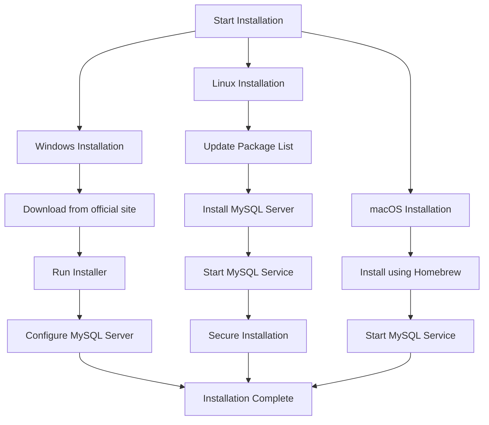

## Introduction
MySQL is an open-source relational database management system (RDBMS) based on SQL (Structured Query Language). It is widely used for web applications and other data-driven applications.

## Installation
### Windows
1. Download MySQL from the [official website](https://dev.mysql.com/downloads/installer/).
2. Run the installer and follow the setup instructions.
3. Configure MySQL Server and create a root password.

### Linux
```sh
sudo apt update
sudo apt install mysql-server
sudo systemctl start mysql
sudo mysql_secure_installation
```

### macOS
```sh
brew install mysql
brew services start mysql
```

