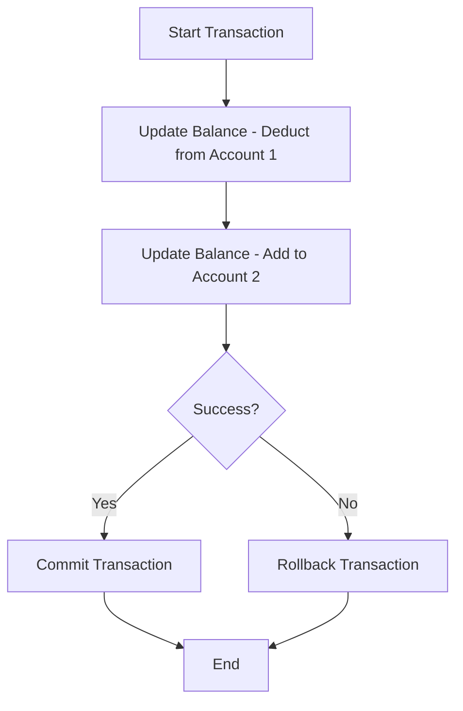

## Transactions

### Using Transactions

```sql
START TRANSACTION;
UPDATE accounts SET balance = balance - 100 WHERE id = 1;
UPDATE accounts SET balance = balance + 100 WHERE id = 2;
COMMIT;
```

### Rolling Back

```sql
ROLLBACK;
```


