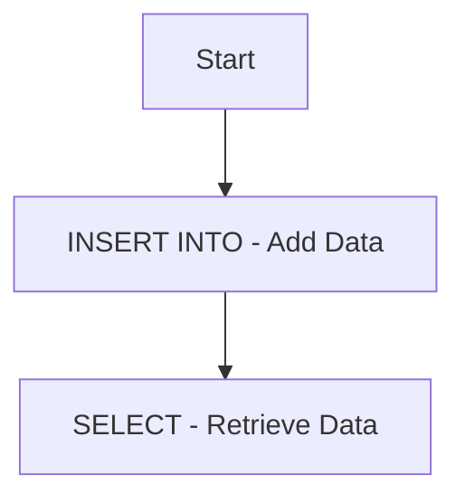

## Table Operations
### Creating a Table
```sql
CREATE TABLE users (
    id INT AUTO_INCREMENT PRIMARY KEY,
    name VARCHAR(100),
    email VARCHAR(100) UNIQUE,
    created_at TIMESTAMP DEFAULT CURRENT_TIMESTAMP
);
```

